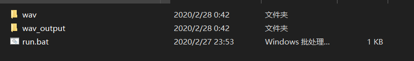
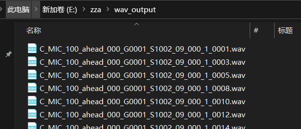
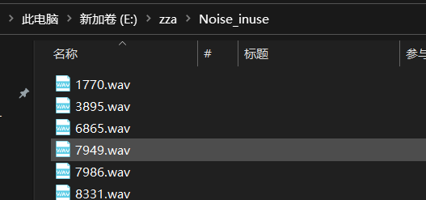
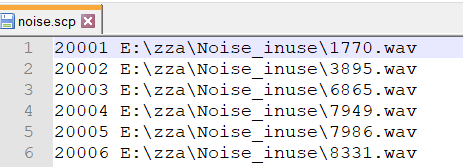
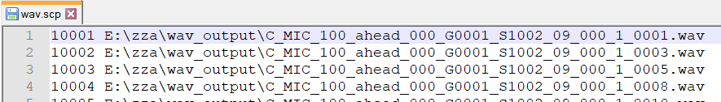

# Audio_mixer

Author: Xin Pan

Date: 2020.02.28

---

[toc]

A series of audio mixing tools for adding noise to clean WAV files. 

These tools working on Windows and python3.5, I guess other python3 formation should be work as well.

This tool can help you mixing some noise audio into clean audios,  like the pic below.

wav stores some original wav files 

wav_output stores the new formation wav files.

## First step - reformate

`00_run.bat` can help you reformate the wav files with following Args. Sample frequency with 16k and bit depth with 16.

00_run.bat will use wav as input dir and wav_output as output dir. Open a cmd window or powerShell works as well.

```powershell
cd $where_you_save_the_files
00_run.bat wav wav_output
```


## Second step - write *.scp files

with the following command:

```powershell
python 01_make_scp.py $WAV_dir $NOISE_dir
```

`01_make_scp.py` will search wav files in `$WAV_dir` and  `$NOISE_dir` write out two files named "wav.scp" and "noise.scp". In which, it writes file names in the corresponding dir.


## Third step - mixing

with the following command:

```powershell
python 02_add-noise-mod-rand3-windows.py --noise-level-low -10 --noise-level-high 15 --sigma 0 --seed 32 --verbose 0 --noise-src noise.scp --wav-src wav.scp --wavdir output
```

`02_add-noise-mod-rand3-windows.py` has lot of params, I will explain what they are used for.

```tex
--noise-level-low is the low level of noise mixed in clean file;
--noise-level-high is the high level of noise mixed in clean file;
--sigma is the variance of noise mixed in clean, if not sigma equals to 0, noise mixed in clean will have extra surge;
-seed is the seed point using for generate random number;
--noise-src should be name of noise.scp file, like "noise.scp"; 
--wav-src is the same of upper, just it stores clean file;
--wavdir is where you want new files stores at.
```

If all good, you should see you new mixed files in `--wavdir`. Please contact me if this tool have bug or problems.

Thank you.


## Appendix

The following pic is the result after **First step**.



The pic down here is one of the input dirs send into **Second step**.



The following 2 pics are what scp files look like. The first line is just a tag, no special meaning.





